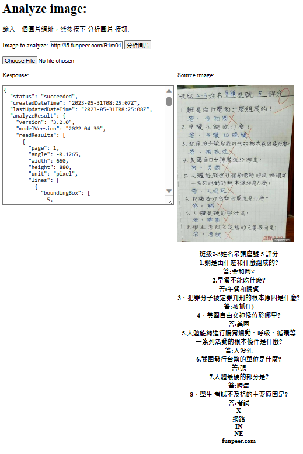

HW5 for LAT-Repo. Using azure image recognition

SCREENSHOT

Ideas and Applications

Using picture to hand in homework or any other simmilar scenario that uses physical paper.

Azure's Computer Vision

Azure's Optical Character Recognition(OCR) services is used in this homework.

The OCR and Read Api detects text in an image and extracts the recognized characters into a machine-usable character stream.